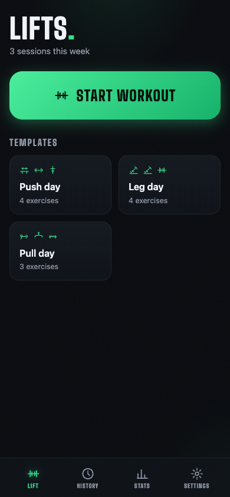
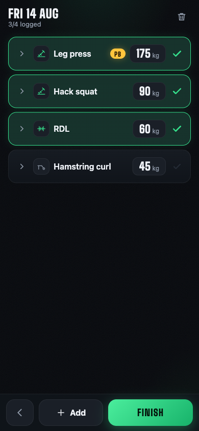
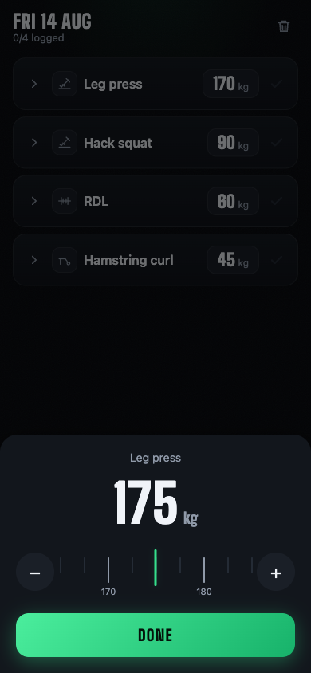
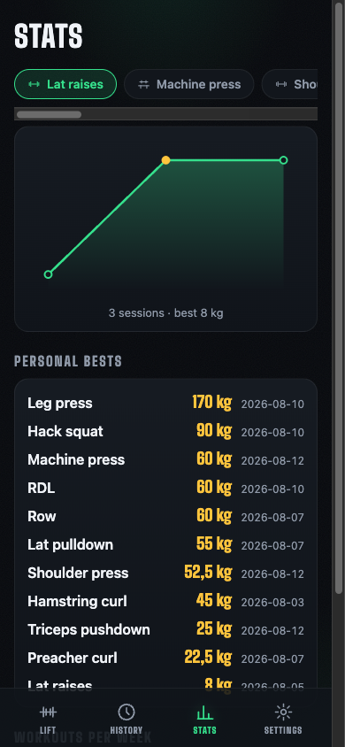

# Lifts.

**A workout log that stays out of your way — and on your phone.**

Lifts replaces the notes file you scribble between sets. Grab your phone, tap the
exercise, confirm the weight it predicted, put the phone down. The whole loop is
designed for one hand, and everything you log stays on your device.

**Live app → [tqfipe.github.io/lifts](https://tqfipe.github.io/lifts/)** — open it
on your phone and *Add to Home Screen* to install.

<p align="center">
  
  
  
  
</p>

## Why another workout app?

Most trackers make you tap through five screens per set. Lifts optimizes one
loop instead:

**between sets → one tap logs the exercise at the weight it predicted.**

Everything else exists to serve that loop without slowing it down.

## Features

- **One-tap logging** — templates pre-fill every exercise with the weight from
  your last session; tap a row to log it.
- **Ruler weight picker** — a snapping, ticking slider for adjustments; type
  only when you want to (decimal comma friendly).
- **Automatic PBs** — strict improvements are detected live, badged gold, and
  celebrated with confetti when you finish the session.
- **Templates** — save any workout as a template; your usual day is two taps.
- **Set detail when you care** — expand a row for per-set weight × reps, notes,
  and reordering; skip it when you don't.
- **Stats out of the way** — per-exercise progression charts, PB table, and
  weekly frequency live in their own tab, never in the logging flow.
- **Common-exercise catalog** — 20+ seeded exercises with hand-drawn SVG
  glyphs; your own freetext names get matching icons too.
- **5 themes, kg/lb, offline-first PWA** — installs to the home screen and
  works with no connection at all.

## Privacy model

- All data lives in your browser's IndexedDB, on your device. **No account, no
  cloud, no server, no analytics.** After the app shell loads, it makes zero
  network requests.
- Backup is a file you own: Settings → *Export backup (.json)*. Restore or
  merge it on any device via Settings → *Import*.
- The flip side of local-first: lose the device or clear site data and the
  history is gone — export backups now and then.

## Importing old notes

Already have months of freetext workout notes? Settings → **Copy LLM conversion
prompt** gives you a prompt to paste into any AI chat along with your notes. It
returns JSON in the app's import format — paste that back into Settings →
Import, and your history, PBs, and predictions carry over.

## Tech

Svelte 5 (runes) · Vite · TypeScript · Vitest · vite-plugin-pwa.
No runtime dependencies beyond Svelte; charts and icons are hand-rolled SVG;
weights are stored canonically in kg with display-side unit conversion.

## Develop

```sh
npm install
npm run dev      # local dev server
npm test         # unit tests (Vitest)
npm run check    # svelte-check
npm run build    # production build (dist/)
```

Pushes to `main` deploy to GitHub Pages via `.github/workflows/deploy.yml`.
Installed apps pick up new versions on their next launch — updates never
interrupt a workout in progress.

## License

[MIT](LICENSE)

---

*Screenshots show synthetic demo data.*
